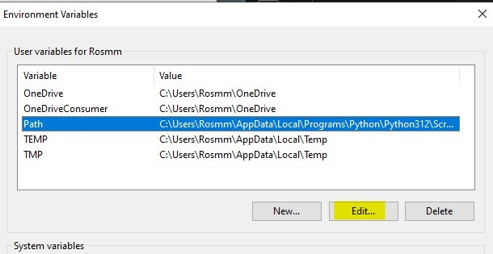
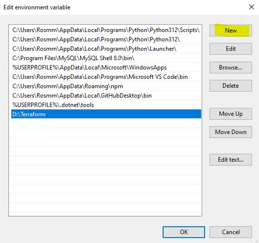

# Terraform 
- [Terraform](#terraform)
- [Step 1: Install Terraform on Windows](#step-1-install-terraform-on-windows)
- [Step 2: Add Terraform to System PATH](#step-2-add-terraform-to-system-path)
- [Step 3: Install Terraform VSCode Extension](#step-3-install-terraform-vscode-extension)
- [Step 4: Create a New Folder/Repository for Terraform Documentation](#step-4-create-a-new-folderrepository-for-terraform-documentation)
- [Terraform](#terraform-1)
  - [What is Terraform? What is it Used For?](#what-is-terraform-what-is-it-used-for)
  - [Why Use Terraform? The Benefits?](#why-use-terraform-the-benefits)
  - [Alternatives to Terraform](#alternatives-to-terraform)
  - [Who is Using Terraform in the Industry?](#who-is-using-terraform-in-the-industry)
  - [In IaC, What is Orchestration? How Does Terraform Act as "Orchestrator"?](#in-iac-what-is-orchestration-how-does-terraform-act-as-orchestrator)
  - [Best Practice for Supplying AWS Credentials to Terraform](#best-practice-for-supplying-aws-credentials-to-terraform)
  - [If Terraform needs AWS access, there are different options on supplying the AWS credentials to Terraform. What is order in which Terraform looks up AWS credentials (which ways take precedence/priority)?](#if-terraform-needs-aws-access-there-are-different-options-on-supplying-the-aws-credentials-to-terraform-what-is-order-in-which-terraform-looks-up-aws-credentials-which-ways-take-precedencepriority)
  - [What is best practice to supply AWS credentials? Include: How should AWS credentials never be passed to Terraform?](#what-is-best-practice-to-supply-aws-credentials-include-how-should-aws-credentials-never-be-passed-to-terraform)
  - [Why use Terraform for different environments (e.g. production, testing, etc)](#why-use-terraform-for-different-environments-eg-production-testing-etc)
- [How to set up environment variables to store AWS access keys on Windows](#how-to-set-up-environment-variables-to-store-aws-access-keys-on-windows)
  - [Step 1: Open System Environment Variables](#step-1-open-system-environment-variables)
  - [Step 2: Verify Environment Variables in Git Bash](#step-2-verify-environment-variables-in-git-bash)
- [Automating with Terraform](#automating-with-terraform)
  - [Step 1 - in VScode](#step-1---in-vscode)
  - [Step 2 :](#step-2-)
  - [Step 3 - In GitBash](#step-3---in-gitbash)

# Step 1: Install Terraform on Windows

1. **Download Terraform**:
    - Go to the official Terraform download page: https://developer.hashicorp.com/terraform/install?product_intent=terraform#windows
    - Select the **Windows AMD64** version and download the ZIP file.
2. **Extract Terraform**:
    - Extract the downloaded ZIP file to a directory (e.g., D:\Terraform).
3. **Move** `terraform.exe` **to a Logical Location**:
    - You can create a folder for all your command-line tools to keep them organized.
        - Recommended: Create a folder `C:\my-cmd-line-tools`.
    - Move `terraform.exe` to `C:\my-cmd-line-tools`.


# Step 2: Add Terraform to System PATH
1. **Open Environment Variables**:
    - Click the **Start** button, type **Environment Variables**, and select **Edit the system environment variables**.

        

    - In the **System Properties** window, click on **Environment Variables**.

        
        
2. **Edit the System PATH**:

    - Under **System variables**, find and select **Path**, then click **Edit**.

        

    - Click **New** and add the path: `D:\Terraform`


        

    - Click **OK** to save the changes.


3. **Verify Installation in Git Bash**:

    - Open Git Bash.
    ```bash
    terraform --version
    ```
    - Output similar to     
    ```bash
    Terraform v1.6.4
    on windows_amd64
    ```


# Step 3: Install Terraform VSCode Extension 

1. **Open VSCode**.
   
2. Click on the **Extensions** icon (left sidebar).
   
3. Search for **Terraform** (official extension by HashiCorp).
   
4. Click **Install**.


# Step 4: Create a New Folder/Repository for Terraform Documentation
1. **Create a New Repository**:

    - Name it something similar to tech264-terraform.
    - You can create this on **GitHub** or your preferred Git service.
    - Clone the repository locally and use it to store your Terraform configuration files.
  

# Terraform

##  What is Terraform? What is it Used For?

* Terraform is an open-source infrastructure-as-code (IaC) tool created by HashiCorp. It allows you to define, provision, and manage infrastructure using a simple, declarative configuration language. You can use Terraform to set up cloud resources (e.g., servers, networks, databases) on various cloud providers like AWS, Azure, GCP, and more.

* Terraform sees infrastructure as **imutable**, language used **HashiCorp**(good balance between **human and machine readability**, can be **converted** to **json** and back again) 

## Why Use Terraform? The Benefits?

   - **Consistency**: Repeatable and consistent deployments.
   - **Scalability**: Easy to scale resources up or down.
   - **Version Control**: Infrastructure changes can be tracked and managed using Git.
   - **Multi-Cloud**: Support for multiple cloud providers using the same tool.
   - **Automation**: Reduce manual setup and configuration, minimizing errors.
   - **Declaration** : Declare what you want not what to do 
   - **Cloud agnostic** : Can deploy to any cloud platform because it uses different cloud provider. Each providerr maintains their own plugins (e.g Azure has an Azure plugin in Terraform that will interface with the API of Azure). 
   - **Easy to use**

## Alternatives to Terraform
- AWS CloudFormation
- Ansible
- Pulumi
- Chef
- Puppet

## Who is Using Terraform in the Industry?

- **Netflix**: To manage multi-cloud environments.
- **Airbnb**: For efficient infrastructure management.
- **Uber**: To automate and scale cloud resources.
- **Spotify**: Uses Terraform to manage deployments on Google Cloud.


## In IaC, What is Orchestration? How Does Terraform Act as "Orchestrator"?
Orchestration involves coordinating multiple resources, services, and tasks to work together. Terraform acts as an orchestrator by managing the dependencies between resources, ensuring that they are created, configured, and linked correctly. It can set up servers, databases, networks, and more in a unified, automated process.

## Best Practice for Supplying AWS Credentials to Terraform
- Use **IAM Roles** attached to instances (preferred in cloud environments).
- Use the **AWS CLI** to configure credentials using aws configure.
- **Environment Variables** can be set, but should be done securely.

## If Terraform needs AWS access, there are different options on supplying the AWS credentials to Terraform. What is order in which Terraform looks up AWS credentials (which ways take precedence/priority)?
1.  **Environment Variables** (`AWS_ACCESS_KEY_ID` and `AWS_SECRET_ACCESS_KEY`)
2. **Shared Credentials File** (`~/.aws/credentials`)
3. **AWS Config Profile** (set via environment variable `AWS_PROFILE`)
4. **Instance Profile Credentials** (IAM roles)

## What is best practice to supply AWS credentials? Include: How should AWS credentials never be passed to Terraform?
- Use **IAM Roles** when running Terraform in a cloud environment. This avoids hardcoding sensitive information.
- Never **hardcode credentials** in Terraform files.
- Avoid passing credentials via **plain text files**.


## Why use Terraform for different environments (e.g. production, testing, etc)

Terraform enables you to create isolated and consistent environments for development, testing, and production. You can use the same infrastructure code to replicate environments, ensuring that they are identical and reducing the risk of discrepancies between them. This approach also allows for quick and easy testing before deploying changes to production.
Benefits include:
- **Consistency** : ensure that all environments are consistent, reducing bugs that arise from manual configuration differences(e.g. testing can be carried out in a consistent environment with matching dependencies to ensure that the  tests in the QA environment run the same in PROD environment, PROD should only differ in scalability)
- **Separation of concerns** : you can isolate environments to prevent accidenal change in production while testing new features
- **Version control** : track infrastructure changes in diofferent environemts with version control 


Used :
- testing environment 


# How to set up environment variables to store AWS access keys on Windows

## Step 1: Open System Environment Variables
1. **Open the Start Menu**:

    - Type **Environment Variables** and click on **Edit the system environment variables**.

2. **Open Environment Variables Window**:

    - In the **System Properties** window, click on **Environment Variables**.
  
3. **Add New System Variables**:

    - Under **System variables**, click **New**.
    - For **Variable Name**, enter **AWS_ACCESS_KEY_ID**.
    - For **Variable Value**, copy the **Access Key ID** from the CSV file you received and paste it.
    - Click **OK**.

4. Repeat the Process for **AWS_SECRET_ACCESS_KEY**:

    - Click **New** again.
    - For **Variable Name**, enter **AWS_SECRET_ACCESS_KEY**.
    - For **Variable Value**, copy the **Secret Access Key** from the CSV file you received and paste it.
    - Click **OK**.
  
5. **Apply Changes**:

    - Click **OK** to close the **Environment Variables** window.
    - Click **OK** again to close the **System Properties** window.

## Step 2: Verify Environment Variables in Git Bash
1. Open a new Git Bash window.
```bash
env | grep AWS
```
2. Output
```bash
AWS_ACCESS_KEY_ID=your-access-key-id
AWS_SECRET_ACCESS_KEY=your-secret-access-key
```


# Automating with Terraform 

## Step 1 - in VScode
1. Create a `.gitignore` :
```bash
# locks the provider (plugin assosiated with) version
# other team members code wont break 
# doesnt contain sesitive info
# doesnt need to be gitignored 
# .terraform.lock.hcl

# doesnt contain sensitive files, just to avoid blot in your remote repos
.terraform/


# most important to protect as they contain credentials 
# used by Terraform
terraform.tfstate
terraform.tfstate.backup

# variables 
*.tfvars
*.auto.tfvars
variable.tf

# override files
override.tf
override.tf.json
```
**!!!! Important file to ignore !!!!:**
```bash
terraform.tfstate
terraform.tfstate.backup
```


## Step 2 : 
1. Create a `main.ft` :
```bash
# aws_access_key = xxxx MUST NEVER DO THIS
# aws_secret_key = xxxx MUST NEVER DO THIS
# syntax often used in HCL is  key = value

# create an ec2 instance
# where to create - provide the provider
provider "aws" {
  # which region to use to create infrastructure
  region = "eu-west-1"
}
# which service/resources to create
resource "aws_instance" "app_instance" {
  # which AMI ID ami-0c1c30571d2dae5c9 (for ubuntu 22.04 lts)
  ami = "ami-0c1c30571d2dae5c9"

  # what type of instance to launch - t2.micro
  instance_type = "t2.micro"

  # add a public ip to this istance
  associate_public_ip_address = true

  # name the service/resource we create
  tags = {
    Name = "tech264-maria-tf-app-instance"
  }

}
```
## Step 3 - In GitBash
1.  **Init**
```bash
terraform init
```


2. **Plan**
```bash
terraform plan
```


3. **Apply**
```bash
terraform apply
```


- Is going to create an instance in AWS
   
    
        
- AWS instance created :

    


4. **Destroy** 
```bash
terraform destroy
```


