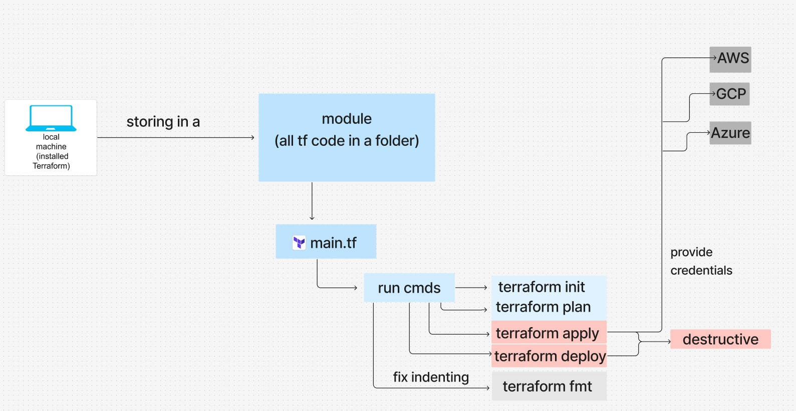
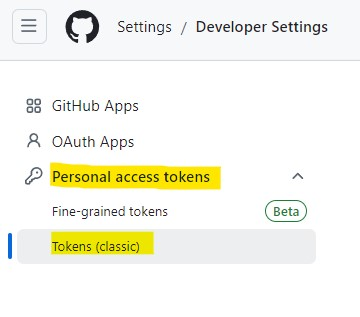

# Terraform 
- [Terraform](#terraform)
- [Step 1: Install Terraform on Windows](#step-1-install-terraform-on-windows)
- [Step 2: Add Terraform to System PATH](#step-2-add-terraform-to-system-path)
- [Step 3: Install Terraform VSCode Extension](#step-3-install-terraform-vscode-extension)
- [Step 4: Create a New Folder/Repository for Terraform Documentation](#step-4-create-a-new-folderrepository-for-terraform-documentation)
- [Terraform](#terraform-1)
  - [What is Terraform? What is it Used For?](#what-is-terraform-what-is-it-used-for)
  - [Why Use Terraform? The Benefits?](#why-use-terraform-the-benefits)
  - [Alternatives to Terraform](#alternatives-to-terraform)
  - [Who is Using Terraform in the Industry?](#who-is-using-terraform-in-the-industry)
  - [In IaC, What is Orchestration? How Does Terraform Act as "Orchestrator"?](#in-iac-what-is-orchestration-how-does-terraform-act-as-orchestrator)
  - [Best Practice for Supplying AWS Credentials to Terraform](#best-practice-for-supplying-aws-credentials-to-terraform)
  - [If Terraform needs AWS access, there are different options on supplying the AWS credentials to Terraform. What is order in which Terraform looks up AWS credentials (which ways take precedence/priority)?](#if-terraform-needs-aws-access-there-are-different-options-on-supplying-the-aws-credentials-to-terraform-what-is-order-in-which-terraform-looks-up-aws-credentials-which-ways-take-precedencepriority)
  - [What is best practice to supply AWS credentials? Include: How should AWS credentials never be passed to Terraform?](#what-is-best-practice-to-supply-aws-credentials-include-how-should-aws-credentials-never-be-passed-to-terraform)
  - [Why use Terraform for different environments (e.g. production, testing, etc)](#why-use-terraform-for-different-environments-eg-production-testing-etc)
- [How to set up environment variables to store AWS access keys on Windows](#how-to-set-up-environment-variables-to-store-aws-access-keys-on-windows)
  - [Step 1: Open System Environment Variables](#step-1-open-system-environment-variables)
  - [Step 2: Verify Environment Variables in Git Bash](#step-2-verify-environment-variables-in-git-bash)
- [Automate with Terraform](#automate-with-terraform)
  - [Step 1 - in VScode](#step-1---in-vscode)
  - [Step 2 :](#step-2-)
  - [Step 3 - In GitBash](#step-3---in-gitbash)
- [Create an nsg rules with terraform](#create-an-nsg-rules-with-terraform)
- [Created an EC2 with NSG](#created-an-ec2-with-nsg)
- [Research](#research)
  - [What is pull and push configuration management (IaC)?  Which tools support push/pull?](#what-is-pull-and-push-configuration-management-iac--which-tools-support-pushpull)
    - [**Pull Configuration Management**](#pull-configuration-management)
    - [**Push Configuration Management**](#push-configuration-management)
    - [**Push vs Pull**](#push-vs-pull)
  - [Does Terraform use the push or pull configuration?](#does-terraform-use-the-push-or-pull-configuration)
  - [Which is better: push or pull configuration management?](#which-is-better-push-or-pull-configuration-management)
  - [Include desired state vs current state in your documentation](#include-desired-state-vs-current-state-in-your-documentation)
- [Use Terraform to create a repo on GitHub](#use-terraform-to-create-a-repo-on-github)
  - [Step 1:  Create a Personal Access Token on GitHub](#step-1--create-a-personal-access-token-on-github)
  - [Step 2: Create Your Terraform Project](#step-2-create-your-terraform-project)
  - [Step 3 : Write the Terraform Code](#step-3--write-the-terraform-code)
  - [Step 4: Initialize and Apply Terraform](#step-4-initialize-and-apply-terraform)
  - [Step 5: Check GitHub](#step-5-check-github)
  - [Step 6: Push Your Terraform Code to GitHub](#step-6-push-your-terraform-code-to-github)

# Step 1: Install Terraform on Windows

1. **Download Terraform**:
    - Go to the official Terraform download page: https://developer.hashicorp.com/terraform/install?product_intent=terraform#windows
    - Select the **Windows AMD64** version and download the ZIP file.
2. **Extract Terraform**:
    - Extract the downloaded ZIP file to a directory (e.g., D:\Terraform).
3. **Move** `terraform.exe` **to a Logical Location**:
    - You can create a folder for all your command-line tools to keep them organized.
        - Recommended: Create a folder `C:\my-cmd-line-tools`.
    - Move `terraform.exe` to `C:\my-cmd-line-tools`.


# Step 2: Add Terraform to System PATH
1. **Open Environment Variables**:
    - Click the **Start** button, type **Environment Variables**, and select **Edit the system environment variables**.

        

    - In the **System Properties** window, click on **Environment Variables**.

        
        
2. **Edit the System PATH**:

    - Under **System variables**, find and select **Path**, then click **Edit**.

        

    - Click **New** and add the path: `D:\Terraform`


        

    - Click **OK** to save the changes.


3. **Verify Installation in Git Bash**:

    - Open Git Bash.
    ```bash
    terraform --version
    ```
    - Output similar to     
    ```bash
    Terraform v1.6.4
    on windows_amd64
    ```


# Step 3: Install Terraform VSCode Extension 

1. **Open VSCode**.
   
2. Click on the **Extensions** icon (left sidebar).
   
3. Search for **Terraform** (official extension by HashiCorp).
   
4. Click **Install**.


# Step 4: Create a New Folder/Repository for Terraform Documentation
1. **Create a New Repository**:

    - Name it something similar to tech264-terraform.
    - You can create this on **GitHub** or your preferred Git service.
    - Clone the repository locally and use it to store your Terraform configuration files.
  

# Terraform

##  What is Terraform? What is it Used For?

* Terraform is an open-source infrastructure-as-code (IaC) tool created by HashiCorp. It allows you to define, provision, and manage infrastructure using a simple, declarative configuration language. You can use Terraform to set up cloud resources (e.g., servers, networks, databases) on various cloud providers like AWS, Azure, GCP, and more.

* Terraform sees infrastructure as **imutable**, language used **HashiCorp**(good balance between **human and machine readability**, can be **converted** to **json** and back again) 

## Why Use Terraform? The Benefits?

   - **Consistency**: Repeatable and consistent deployments.
   - **Scalability**: Easy to scale resources up or down.
   - **Version Control**: Infrastructure changes can be tracked and managed using Git.
   - **Multi-Cloud**: Support for multiple cloud providers using the same tool.
   - **Automation**: Reduce manual setup and configuration, minimizing errors.
   - **Declaration** : Declare what you want not what to do 
   - **Cloud agnostic** : Can deploy to any cloud platform because it uses different cloud provider. Each providerr maintains their own plugins (e.g Azure has an Azure plugin in Terraform that will interface with the API of Azure). 
   - **Easy to use**

## Alternatives to Terraform
- AWS CloudFormation
- Ansible
- Pulumi
- Chef
- Puppet

## Who is Using Terraform in the Industry?

- **Netflix**: To manage multi-cloud environments.
- **Airbnb**: For efficient infrastructure management.
- **Uber**: To automate and scale cloud resources.
- **Spotify**: Uses Terraform to manage deployments on Google Cloud.


## In IaC, What is Orchestration? How Does Terraform Act as "Orchestrator"?
Orchestration involves coordinating multiple resources, services, and tasks to work together. Terraform acts as an orchestrator by managing the dependencies between resources, ensuring that they are created, configured, and linked correctly. It can set up servers, databases, networks, and more in a unified, automated process.

## Best Practice for Supplying AWS Credentials to Terraform
- Use **IAM Roles** attached to instances (preferred in cloud environments).
- Use the **AWS CLI** to configure credentials using aws configure.
- **Environment Variables** can be set, but should be done securely.

## If Terraform needs AWS access, there are different options on supplying the AWS credentials to Terraform. What is order in which Terraform looks up AWS credentials (which ways take precedence/priority)?
1.  **Environment Variables** (`AWS_ACCESS_KEY_ID` and `AWS_SECRET_ACCESS_KEY`)
2. **Shared Credentials File** (`~/.aws/credentials`)
3. **AWS Config Profile** (set via environment variable `AWS_PROFILE`)
4. **Instance Profile Credentials** (IAM roles)

## What is best practice to supply AWS credentials? Include: How should AWS credentials never be passed to Terraform?
- Use **IAM Roles** when running Terraform in a cloud environment. This avoids hardcoding sensitive information.
- Never **hardcode credentials** in Terraform files.
- Avoid passing credentials via **plain text files**.


## Why use Terraform for different environments (e.g. production, testing, etc)

Terraform enables you to create isolated and consistent environments for development, testing, and production. You can use the same infrastructure code to replicate environments, ensuring that they are identical and reducing the risk of discrepancies between them. This approach also allows for quick and easy testing before deploying changes to production.
Benefits include:
- **Consistency** : ensure that all environments are consistent, reducing bugs that arise from manual configuration differences(e.g. testing can be carried out in a consistent environment with matching dependencies to ensure that the  tests in the QA environment run the same in PROD environment, PROD should only differ in scalability)
- **Separation of concerns** : you can isolate environments to prevent accidenal change in production while testing new features
- **Version control** : track infrastructure changes in diofferent environemts with version control 


Used :
- testing environment 


# How to set up environment variables to store AWS access keys on Windows

## Step 1: Open System Environment Variables
1. **Open the Start Menu**:

    - Type **Environment Variables** and click on **Edit the system environment variables**.

2. **Open Environment Variables Window**:

    - In the **System Properties** window, click on **Environment Variables**.
  
3. **Add New System Variables**:

    - Under **System variables**, click **New**.
    - For **Variable Name**, enter **AWS_ACCESS_KEY_ID**.
    - For **Variable Value**, copy the **Access Key ID** from the CSV file you received and paste it.
    - Click **OK**.

4. Repeat the Process for **AWS_SECRET_ACCESS_KEY**:

    - Click **New** again.
    - For **Variable Name**, enter **AWS_SECRET_ACCESS_KEY**.
    - For **Variable Value**, copy the **Secret Access Key** from the CSV file you received and paste it.
    - Click **OK**.
  
5. **Apply Changes**:

    - Click **OK** to close the **Environment Variables** window.
    - Click **OK** again to close the **System Properties** window.

## Step 2: Verify Environment Variables in Git Bash
1. Open a new Git Bash window.
```bash
env | grep AWS
```
2. Output
```bash
AWS_ACCESS_KEY_ID=your-access-key-id
AWS_SECRET_ACCESS_KEY=your-secret-access-key
```


# Automate with Terraform 




## Step 1 - in VScode
1. Create a `.gitignore` :
```bash
# locks the provider (plugin assosiated with) version
# other team members code wont break 
# doesnt contain sesitive info
# doesnt need to be gitignored 
# .terraform.lock.hcl

# doesnt contain sensitive files, just to avoid blot in your remote repos
.terraform/


# most important to protect as they contain credentials 
# used by Terraform
terraform.tfstate
terraform.tfstate.backup

# variables 
*.tfvars
*.auto.tfvars
variable.tf

# override files
override.tf
override.tf.json
```
**!!!! Important file to ignore !!!!:**
```bash
terraform.tfstate
terraform.tfstate.backup
```


## Step 2 : 
1. Create a `main.ft` :
```bash
# aws_access_key = xxxx MUST NEVER DO THIS
# aws_secret_key = xxxx MUST NEVER DO THIS
# syntax often used in HCL is  key = value

# create an ec2 instance
# where to create - provide the provider
provider "aws" {
  # which region to use to create infrastructure
  region = "eu-west-1"
}
# which service/resources to create
resource "aws_instance" "app_instance" {
  # which AMI ID ami-0c1c30571d2dae5c9 (for ubuntu 22.04 lts)
  ami = "ami-0c1c30571d2dae5c9"

  # what type of instance to launch - t2.micro
  instance_type = "t2.micro"

  # add a public ip to this istance
  associate_public_ip_address = true

  # name the service/resource we create
  tags = {
    Name = "tech264-maria-tf-app-instance"
  }

}
```
## Step 3 - In GitBash
1.  **Init**
```bash
terraform init
```


2. **Plan**
```bash
terraform plan
```


3. **Apply**
```bash
terraform apply
```


- Is going to create an instance in AWS
   
    
        
- AWS instance created :

    


4. **Destroy** 
```bash
terraform destroy
```


# Create an nsg rules with terraform

```bash
# Specify the AWS provider
provider "aws" {
    region = "eu-west-1"
}

# Create a security group named tech264-maria-tf-allow-port-22-3000-80
resource "aws_security_group" "tech264_maria_tf_sg" {
  name        = "tech264-maria-tf-allow-port-22-3000-80"
  description = "Security group allowing ports 22, 3000, and 80"

  # Allow SSH (port 22) from localhost
  ingress {
    from_port   = 22
    to_port     = 22
    protocol    = "tcp"
    cidr_blocks = ["0.0.0.0/0"]
  }

  # Allow port 3000 from all IP addresses
  ingress {
    from_port   = 3000
    to_port     = 3000
    protocol    = "tcp"
    cidr_blocks = ["0.0.0.0/0"]
  }

  # Allow HTTP (port 80) from all IP addresses
  ingress {
    from_port   = 80
    to_port     = 80
    protocol    = "tcp"
    cidr_blocks = ["0.0.0.0/0"]
  }

  tags = {
    Name = "tech264-maria-tf-sg"
  }
}
```

# Created an EC2 with NSG

```bash
# Specify the AWS provider
provider "aws" {
    region = "eu-west-1"
}

# Create an EC2 instance with the specified settings
resource "aws_instance" "app_instance" {
  ami             = "ami-0c1c30571d2dae5c9"

  instance_type   = "t2.micro"

  key_name        = "tech264-maria-aws-key"  

  associate_public_ip_address = true

  # Attach the created security group
  vpc_security_group_ids = ["sg-06e3ea067984c928b"]

  tags = {
    Name = "tech264-maria-tf-app-instance"
  }
}
```


# Research

## What is pull and push configuration management (IaC)?  Which tools support push/pull?

### **Pull Configuration Management**
- **Definition**: In a pull-based configuration management model, **the nodes (servers, VMs, etc.)** themselves fetch the desired configuration from a central server. Each node is responsible for ensuring that it is configured according to the central configuration by regularly "pulling" the required configuration updates.
  
- **Desired State vs. Current State**: The node checks its current state against the desired state defined in the central configuration. If discrepancies are found, the node applies the required changes to match the desired state.

- **Examples of Pull-Based Tools:**
  - **Puppet**: Nodes (agents) periodically pull the configuration from a Puppet master server.
  - **Chef**: Chef clients (nodes) pull configuration recipes from a central Chef server.
  - **SaltStack**: Can work in a pull mode where minions request configuration from the master server.
  
- **Benefits**:
    - Scales well with a large number of nodes, as each node independently fetches its configuration.
    - Less dependency on the central server since each node manages itself.

- **Challenges**:
    - Requires agents on each node, which can lead to version control and compatibility issues.
    - Configuration updates might not be instantaneous, depending on how often nodes pull from the server.

### **Push Configuration Management**
- **Definition**: In a push-based configuration management model, **the central server pushes configuration updates directly to the nodes.** The central server controls the deployment, ensuring nodes are configured according to the latest changes.

- **Desired State vs. Current State**: The central server pushes configurations that should bring each node to the desired state, checking or enforcing consistency directly.

- **Examples of Push-Based Tools:**
    - **Ansible**: Uses SSH to push configuration changes directly to nodes.
    - **SaltStack**: Can also be used in a push mode where the master pushes updates to the minions.

- **Benefits**:
    - Immediate application of configuration changes, as updates are pushed directly.
    - No need for agents on nodes (e.g., Ansible uses SSH).

- **Challenges:**
    - Can be less scalable for a large number of nodes, as the central server handles all the configuration tasks.
    - The central server must maintain connectivity with all nodes for effective configuration.

### **Push vs Pull**
- **Push vs. Pull**: Push configuration is better for **direct, fast updates**, while pull configuration is better for **scalable, self-managing nodes**.
  
## Does Terraform use the push or pull configuration?

- **Terraform primarily uses a Push-Based Approach**:
    - When you run `terraform apply`, Terraform **pushes the desired state configuration** directly to the infrastructure provider (e.g., AWS, Azure, Google Cloud).

    - Terraform sends API requests to the cloud provider to create, update, or delete resources to match the desired state specified in the `.tf` files.

    - Terraform ensures **idempotency** by checking the current state of the infrastructure and comparing it to the desired state. It will only push changes if there is a difference.

    - Since there are no agents, Terraform relies on APIs to execute changes, making it a **declarative and agentless push model**.
  
## Which is better: push or pull configuration management?
- **When to Use Pull Configuration**:
    - Suitable for **large, distributed environments** with many nodes.

    - Preferred when you want **each node to self-manage** and maintain its configuration.
    
    - Examples: **Puppet, Chef**.
  
- **When to Use Push Configuration:**
    - Ideal for environments where **instantaneous updates** are required.

    - Useful for **smaller infrastructures or specific tasks** where you want more direct control.
    
    - Examples: **Ansible, Terraform**.
    
- **Conclusion**:
    - **Pull-based systems** scale better but may introduce latency in how fast configurations are updated.
    
    - **Push-based systems** provide faster configuration updates but might not scale as easily without affecting performance.
    
    - The choice depends on **scale, control needs, and the specific requirements** of the infrastructure.

## Include desired state vs current state in your documentation
- **Desired State**: The ideal configuration that defines how infrastructure or nodes should be set up. For example, defining the number of servers, their configurations, security rules, etc.

- **Current State**: The actual state of the infrastructure at a given moment. This includes the current setup and configurations of all nodes.

- **Reconciliation**: Configuration management tools reconcile the **desired state with the current state**. If differences are found (drift), the tools will make the necessary changes to bring the current state in line with the desired state.


# Use Terraform to create a repo on GitHub

## Step 1:  Create a Personal Access Token on GitHub

1. **Log in to GitHub**.
2. **Go to Settings > Developer settings > Personal access tokens > Generate new token.**

    

    

3. **Name the Token** (e.g., `Terraform Automation`) and select the following permissions:
- `repo` (this will allow Terraform to create repositories)
- `delete_repo` (optional, if you want Terraform to delete repos)

4. **Generate Token** and **Copy the Token**. Keep it safe .

## Step 2: Create Your Terraform Project

1. Create a New Directory:
```bash
mkdir tech2xx-tf-create-github-repo
cd tech2xx-tf-create-github-repo
```
2. Create the Following Files:
  
- `main.tf`: Where your main Terraform code will go.
- `variables.tf`: To define any variables you will use.
- `.gitignore`: To ignore any files you don’t want to commit.
- `terraform.tfvars`: To store your sensitive information securely.

## Step 3 : Write the Terraform Code

1. `main.tf`

```bash
# Use the GitHub provider
provider "github" {
  token = var.github_token  # Terraform will use this token to access GitHub
}

# Create a GitHub repository
resource "github_repository" "tech2xx_repo" {
  name        = "tech2xx-tf-create-github-repo"
  description = "A public repository created using Terraform"
  visibility  = "public"  # Can be "private" or "public"
  
  has_issues   = true
  has_projects = true
  has_wiki     = true
}
```

2. `variables.tf`

```bash
variable "github_token" {
  description = "The GitHub Personal Access Token for authentication"
  type        = string
  sensitive   = true
}
```
3. `.gitignore`
```bash
.terraform/
terraform.tfstate
terraform.tfstate.backup
.terraform.lock.hcl
*.tfvars 
```
4. `terraform.tfvars`
```bash
github_token = "your_github_personal_access_token_here"
```
**Note**: Do not commit `terraform.tfvars` to GitHub. It contains sensitive information.

## Step 4: Initialize and Apply Terraform

1. **Open Terminal in Your Project Directory**:
```bash
terraform init
```

2. **Run a Terraform Plan:**
```bash
terraform plan
```

3. **Apply the Terraform Code:**
```bash
terraform apply
```

## Step 5: Check GitHub

After running the `terraform apply` command, go to your GitHub account and check if the repository `tech2xx-tf-create-github-repo` has been created.

## Step 6: Push Your Terraform Code to GitHub

1. Initialize a Git Repository:
```bash
git init
git add .
git commit -m "Initial commit for Terraform GitHub repo automation"
```

2. Add Your GitHub Repo as Remote and Push
```bash
git remote add origin https://github.com/yourusername/tech2xx-tf-create-github-repo.git
git push -u origin main
```

3. To exclude .gitignore to not be commited 
```bash
git rm --cached .gitignore

git commit -m "Remove .gitignore from repository"

git push origin main
```